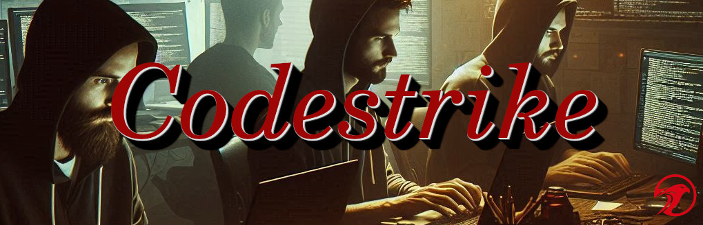

# Codestrike Hack-a-thon Submission Portal
<div align="center">
  
</div>
<br/>
A modern, responsive web application for managing hackathon submissions, judging, and administration. Built with Flask, Bootstrap 5, and custom neuromorphic design elements.

## Features

### For Participants
- Submit hackathon projects with comprehensive project details
- Preview submissions before final submission
- View all current submissions.
- Access judging criteria and competition rules
- Check submission deadlines and prize information
- View winners after competition ends

### For Administrators
- Secure admin panel with authentication
- Manage hackathon details including:
  - Submission deadlines
  - Event description and rules
  - Prize information
  - Hackathon logo
- User management capabilities:
  - Team management
  - Email registration control
  - Winner selection and management

## Technical Stack

- **Frontend**:
  - Bootstrap 5.1.3
  - Bootstrap Icons 1.7.2
  - Custom neuromorphic CSS design
  - Responsive layout for all device sizes
  - Modal-based interface for forms and information display

- **Backend Dependencies**:
  - Flask 3.1.0
  - Pillow 11.1.0
  - Transformers 4.48.3
  - PyTorch 2.6.0
  - Jinja2 templating engine (included with Flask)

## Installation

### Option 1: Local Installation

1. Clone the repository

2. Create and activate a virtual environment (recommended):
```bash
python -m venv venv
source venv/bin/activate  # On Windows use: venv\Scripts\activate
```

3. Install dependencies using requirements.txt:
```bash
pip install -r requirements.txt
```

4. Set up static files:
```bash
mkdir static
mkdir static/css
mkdir static/js
mkdir static/images
```

5. Add your logo to `static/images/`

6. Configure your environment variables:
```bash
export FLASK_APP=app.py
export FLASK_ENV=development
```

### Option 2: Docker Deployment

1. Make sure Docker and Docker Compose are installed on your system

2. Create the required data files in your project root:
```bash
touch submissions.json
touch users_and_teams.json
touch winners.csv
touch hackathon_details.json
touch admin_credentials.txt
```

3. Deploy using Docker Compose:
```bash
docker-compose up -d
```

4. Access the application at `http://localhost:5000`

## Project Structure

```
├── templates/
│   └── index.html
├── static/
│   ├── css/
│   │   └── style.css
│   ├── js/
│   │   └── main.js
│   └── images/
│       └── 1-Red_Falcon_FAI_scaled.png
├── app.py
├── requirements.txt
├── docker-compose.yml
├── Dockerfile
├── submissions.json
├── users_and_teams.json
├── winners.csv
├── hackathon_details.json
├── admin_credentials.txt
└── README.md
```

## Data Persistence

The application uses several JSON and CSV files for data storage:

- `submissions.json`: Stores all hackathon project submissions
- `users_and_teams.json`: Contains user and team information
- `winners.csv`: Maintains the list of winners
- `hackathon_details.json`: Stores hackathon configuration and details
- `admin_credentials.txt`: Contains administrator login credentials
- `static/`: Directory for static files (images, CSS, JS)

When running with Docker, these files are mounted as volumes to ensure data persistence between container restarts.

## Security Features

- Form validation on both client and server side
- Secure admin authentication system
- Protected API endpoints
- XSS protection through proper escaping
- CSRF protection for form submissions

## User Interface Components

### Main Page
- Responsive header with navigation menu
- Hackathon details card with:
  - Event description
  - Timeline
  - Prize information
  - Rules and requirements
  - Contact information

### Modals
1. Submit Project Modal
   - Team information
   - Project details
   - Demo credentials
   - Preview functionality

2. Admin Panel Modal
   - Basic administration
   - User management
   - Winners management

3. Other Modals
   - Judging criteria
   - Terms and conditions
   - Winners list
   - All submissions

## Customization

### Styling
The portal uses a custom neuromorphic design system. Main style classes:
- `.neuromorphic`: Base neuromorphic effect
- `.header-shadow`: Special shadow for header
- `.footer-shadow`: Special shadow for footer
- `.neuromorphic-input`: Form input styling

### Theme
- Dark theme by default
- Customizable through CSS variables
- Responsive design breakpoints

## Administration Guide

### Accessing Admin Panel
1. Click the Admin button in the header menu
2. Log in with admin credentials
3. Access three main administration areas:
   - Basic Administration
   - User Management
   - Winners Management

### Managing Hackathon Details
Through the admin panel, you can update:
- Submission deadline
- Hackathon logo
- Event description
- Rules and requirements
- Prize information

## Development

### Prerequisites
- Python 3.8+ (for local development)
- Docker and Docker Compose (for containerized deployment)
- Modern web browser
- Basic understanding of Bootstrap 5
- Sufficient disk space for PyTorch and Transformers libraries

### Local Development
1. Start the Flask development server:
```bash
flask run
```

2. Access the application at `http://localhost:5000`

### Docker Development
1. Build and start the container:
```bash
docker-compose up --build
```

2. For subsequent runs:
```bash
docker-compose up -d
```

3. View logs:
```bash
docker-compose logs -f
```

4. Stop the container:
```bash
docker-compose down
```

### Dependencies Version Control
All dependencies are specified in requirements.txt:
```
flask==3.1.0
pillow==11.1.0
transformers==4.48.3
torch==2.6.0
```

## License

Copyright @2025 by FALCONS.AI - All rights reserved

## Support

For technical support or questions, contact: info@falcons.ai
